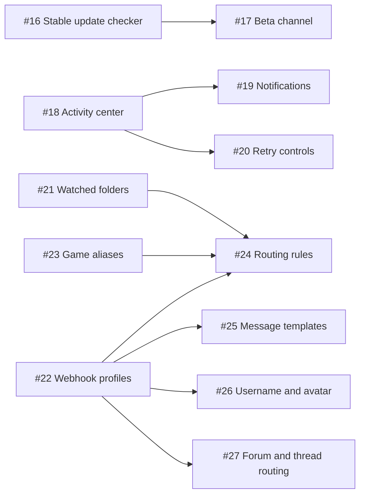

# Product roadmap

This roadmap turns larger product ideas into independently assignable GitHub issues. The milestones describe the intended sequence, not promised release dates. Individual issues and pull requests are the source of truth for implementation status.

## Product principles

- Keep the app local-first: no ClipCord account or hosted service is required.
- Keep ordinary Discord webhooks as the integration boundary; do not require a bot token.
- Preserve atomic settings/state writes, DPAPI secret encryption, centralized webhook redaction, host allow-listing, bounded work, retry/backoff, persisted deduplication, and persist-before-move recovery.
- Existing installations must migrate without upload spam, lost settings, or silent behavior changes.
- Unfinished work must not be advertised to stable users.
- Prefer small, testable additions over turning the tray utility into a full video editor.

## Current priority

1. [#17 Opt-in beta channel](https://github.com/malikpervez/clips-to-discord/issues/17) — expose public prereleases only to users who explicitly choose them while stable remains the default.
2. [#18 Activity center](https://github.com/malikpervez/clips-to-discord/issues/18) — activate the Activity experience and make discovery, queueing, upload, compression, completion, and failure state visible.
3. After the Activity foundation ships, implement [#19 Windows notifications](https://github.com/malikpervez/clips-to-discord/issues/19) and [#20 retry/re-upload controls](https://github.com/malikpervez/clips-to-discord/issues/20) as separate changes.

## Recently shipped

- [#16 Stable-only update checker](https://github.com/malikpervez/clips-to-discord/issues/16) — shipped, followed by verified in-app download and installation in ClipCord v1.5.0.
- [#32 Local-only mode](https://github.com/malikpervez/clips-to-discord/issues/32) — shipped in ClipCord v1.6.0 with durable routing, restart recovery, and no webhook requirement while uploads are disabled.
- ClipCord v1.6.1 polished the Settings opening size and aligned the primary text fields.

## Planned milestones

Product phases describe dependency and outcome order. They are not promises that a phase name will match a future semantic-version number; release versions are assigned when reviewed work is ready to ship.

| Milestone | Outcome | Agent-ready work |
| --- | --- | --- |
| [User control and release channels](https://github.com/malikpervez/clips-to-discord/milestone/1) | Let users control what leaves their computer and which release channel they follow. | [#16 stable-only update checker](https://github.com/malikpervez/clips-to-discord/issues/16) and [#32 local-only mode](https://github.com/malikpervez/clips-to-discord/issues/32) are complete; [#17 opt-in beta channel](https://github.com/malikpervez/clips-to-discord/issues/17) is next. |
| [Activity and recovery](https://github.com/malikpervez/clips-to-discord/milestone/2) | Make upload status and safe recovery visible in the app. | [#18 Activity center](https://github.com/malikpervez/clips-to-discord/issues/18), then [#19 Windows notifications](https://github.com/malikpervez/clips-to-discord/issues/19) and [#20 retry/re-upload controls](https://github.com/malikpervez/clips-to-discord/issues/20). |
| [Profiles and routing](https://github.com/malikpervez/clips-to-discord/milestone/3) | Support several clip sources and Discord destinations with predictable routing. | [#21 Multiple watched folders](https://github.com/malikpervez/clips-to-discord/issues/21), [#22 encrypted webhook profiles](https://github.com/malikpervez/clips-to-discord/issues/22), [#23 game-name aliases](https://github.com/malikpervez/clips-to-discord/issues/23), [#24 routing and exclusions](https://github.com/malikpervez/clips-to-discord/issues/24), [#25 message templates](https://github.com/malikpervez/clips-to-discord/issues/25). |
| [Discord organization](https://github.com/malikpervez/clips-to-discord/milestone/4) | Improve attribution and organization when friends share destinations. | [#26 Per-upload username/avatar](https://github.com/malikpervez/clips-to-discord/issues/26), [#27 forum/thread routing](https://github.com/malikpervez/clips-to-discord/issues/27). |
| [Future exploration](https://github.com/malikpervez/clips-to-discord/milestone/5) | Gather evidence before committing larger media features. | [#28 Research lightweight clip preparation](https://github.com/malikpervez/clips-to-discord/issues/28) |

## Dependency order

Issues without an incoming dependency arrow can be investigated in parallel. A dependent issue should not be implemented until the prerequisite interface and migration behavior are merged, unless its issue explicitly narrows the work to a design proposal.

## Assigning work to an agent

Every planned item carries the [`agent-ready`](https://github.com/malikpervez/clips-to-discord/issues?q=is%3Aissue%20state%3Aopen%20label%3Aagent-ready) label and contains an outcome, constraints, acceptance criteria, and handoff notes.

1. Choose an open `agent-ready` issue whose listed dependencies are closed.
2. Assign the GitHub issue to the responsible human when possible, and give the issue URL to the coding agent. A local agent does not need its own GitHub account; the issue number is the work contract.
3. Use one branch and one focused pull request per issue. Include `Closes #<issue-number>` in the pull request body.
4. Require the agent to read the issue, `CONTRIBUTING.md`, and any architecture/security documents linked by the issue before editing.
5. Require tests and concrete validation evidence in the pull request. Keep the pull request in draft while it is incomplete or awaiting review.
6. Do not combine neighboring roadmap issues merely because the same files are involved. Update dependency links if implementation reveals a new prerequisite.

Suggested handoff prompt:

> Implement GitHub issue `#<number>` in `malikpervez/clips-to-discord`. Treat the issue's scope, safeguards, dependencies, and acceptance criteria as authoritative. Keep the change focused, add appropriate tests and documentation, run the repository validation, and open a draft pull request with `Closes #<number>` plus the evidence needed for review. Do not publish a release.

## Release-channel policy

- Branches, pull requests, tags without releases, and Actions artifacts are development material. Update checks must never expose them to users.
- GitHub prereleases are public test builds and belong only in an explicit opt-in beta channel.
- A normal GitHub release marked Latest is the stable channel and should be created only after review and required checks pass.
- Public repository branches and pull requests are visible to everyone. Work that must remain confidential needs a private repository or private fork; labeling it beta does not make its source private.

## Deliberate non-goals

- A ClipCord cloud account or central upload service.
- A Discord bot-token requirement for ordinary operation.
- Background or forced update installation without an explicit user choice.
- A general-purpose video editor.
