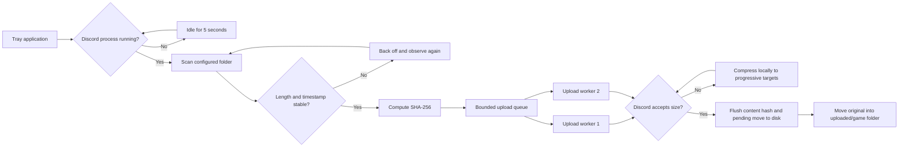

# Architecture

Clips to Discord is a self-contained .NET 8 Windows Forms tray application. It is independent of the software that creates the clip; the input contract is a completed top-level `.mp4` file in the configured folder.

## Components

- `TrayApplicationContext` owns the notification-area UI, settings dialog, startup registration, and controller lifecycle.
- `DiscordAwareController` starts and cancels the uploader worker based on Discord desktop processes, debounces brief absences, and observes each worker before restart or shutdown.
- `FileReadinessTracker` requires stable metadata across multiple observations and exponentially backs off unreadable files.
- `UploaderWorker` discovers clips, computes content identity, feeds a bounded queue, and runs two upload consumers.
- `DiscordWebhookClient` sends multipart attachments with uploader/game attribution, disabled mentions, separate connection and total deadlines, and progressively smaller compression retries.
- `FfmpegCompressor` performs local two-pass H.264/AAC compression to a requested target.
- `SettingsStore` encrypts the webhook with DPAPI and performs staged legacy migration.
- `WatchStateStore` uses durable atomic replacement for content hashes, safe-baseline keys, and pending archive moves.
- `GitHubUpdateChecker` fetches only the repository's fixed latest-release endpoint, validates stable release and installer metadata, and uses bounded response sizes and deadlines.
- `UpdateCoordinator` enforces the 24-hour automatic-check interval, prevents concurrent checks, and applies persisted skip/remind choices.
- `UpdatePreferencesStore` atomically stores non-secret update timing and suppression preferences separately from the DPAPI-protected webhook settings.
- The application manifest declares `longPathAware` for supported Windows systems, reducing legacy `MAX_PATH` failures when clips are archived under game subfolders.
- `SensitiveDataRedactor` strips registered or recognizable Discord webhook URLs before log output.

## Reliability choices

- Files must be at least twenty seconds past their last write and need matching length and timestamp observations at least ten seconds apart.
- Read probes allow other readers but deny concurrent writers; three consecutive open failures produce a throttled stuck-file log.
- Read access uses shared mode for recorder compatibility; failures back off exponentially up to five minutes.
- SHA-256 identity survives file, folder, and timestamp renames at the cost of one full local read per new clip.
- Two workers isolate the queue from one slow request; each HTTP upload has a five-minute deadline and connection establishment has a 15-second deadline.
- Confirmed upload state is flushed to disk before any archive move.
- Move destinations never overwrite existing files.
- Archive-folder resolution reuses case-insensitive `uploaded` and game-name matches, creates lowercase `uploaded` only when none exists, and uses `Uncategorized` when no supported filename timestamp exposes a game name.
- Safe baselines hash legacy root-level archives and one-level game subfolders, including normal iCloud placeholder folders, while refusing to traverse symbolic links and junctions.
- Upload failures retry after five minutes.
- A named mutex prevents multiple tray-app instances.
- Three consecutive two-second Discord-absence polls are required before watcher cancellation; a brief updater relaunch therefore does not churn the worker.
- Controller disposal waits at most ten seconds on the UI thread, while any slower worker cleanup remains observed in the background.
- Every runtime access to mutable watch-state collections is serialized through one gate shared by the scanner and both upload workers.
- Version 1.1+ copies compatible settings from the former Moments to Discord data directory without deleting the original files.
- Stable update discovery accepts only a newer semantic version with exact official GitHub release/asset paths and a SHA-256 asset digest or bounded checksum-manifest entry. It opens the release page and never executes an installer.

See [RELIABILITY.md](RELIABILITY.md) for the exact-once limitation and migration details.

## Packaging

`scripts/get-ffmpeg.ps1` downloads one pinned, versioned FFmpeg archive and validates the archive, executable, and license SHA-256 values. `scripts/package.ps1` publishes a single-file, self-contained `win-x64` executable and bundles FFmpeg only together with its license. `scripts/build-installer.ps1` accepts exactly `ClipsToDiscord.exe`, `README.txt`, and the FFmpeg/license pair for releases; directories, reparse points, settings, state, logs, and every other item fail the build. The Inno script names those four sources explicitly rather than using a recursive wildcard. After all installer tests pass on `main`, CI uploads the exact installer, portable ZIP, and checksum manifest as a release-candidate artifact.

The installer targets `%LOCALAPPDATA%\Programs\ClipsToDiscord`; the ZIP remains the portable option. `scripts/get-inno-setup.ps1` pins the official installer SHA-256, uses a temporary download, and validates a deterministic SHA-256 identity over all 132 compiler-tree files before every cached use and after extraction. Build outputs and third-party binaries are excluded from Git.
