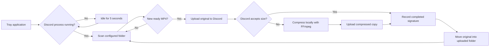

# Architecture

Clips to Discord is a self-contained .NET 8 Windows Forms tray application. It is intentionally independent of the software that creates the clip; the only input contract is a completed top-level `.mp4` file in the configured folder.

## Components

- `TrayApplicationContext` owns the notification-area UI, settings dialog, startup registration, and controller lifecycle.
- `DiscordAwareController` starts and cancels the uploader worker based on Discord desktop processes.
- `UploaderWorker` scans for stable top-level `.mp4` files, manages retries, persists state, and archives successful originals.
- `DiscordWebhookClient` sends webhook messages and multipart video attachments without allowing mentions.
- `FfmpegCompressor` performs local two-pass H.264/AAC compression only after a size rejection.
- `SettingsStore` encrypts the webhook with DPAPI and writes settings atomically.
- `WatchStateStore` prevents duplicate uploads and persists pending archive moves.

## Reliability choices

- Files must be at least 20 seconds old and openable with exclusive access.
- Discord success is persisted before the original is moved, preventing duplicate posts after a move failure.
- Move destinations never overwrite existing files.
- Archive-folder resolution reuses any case-insensitive `uploaded` match and creates lowercase `uploaded` only when none exists.
- Upload failures retry after five minutes.
- Settings and state files use temporary-file replacement.
- A named mutex prevents multiple tray-app instances.
- Version 1.1 copies compatible settings from the former Moments to Discord data directory without deleting the original files.

## Packaging

`scripts/package.ps1` publishes a single-file, self-contained `win-x64` executable and optionally bundles a separately licensed FFmpeg binary. Build outputs and third-party binaries are excluded from Git.
